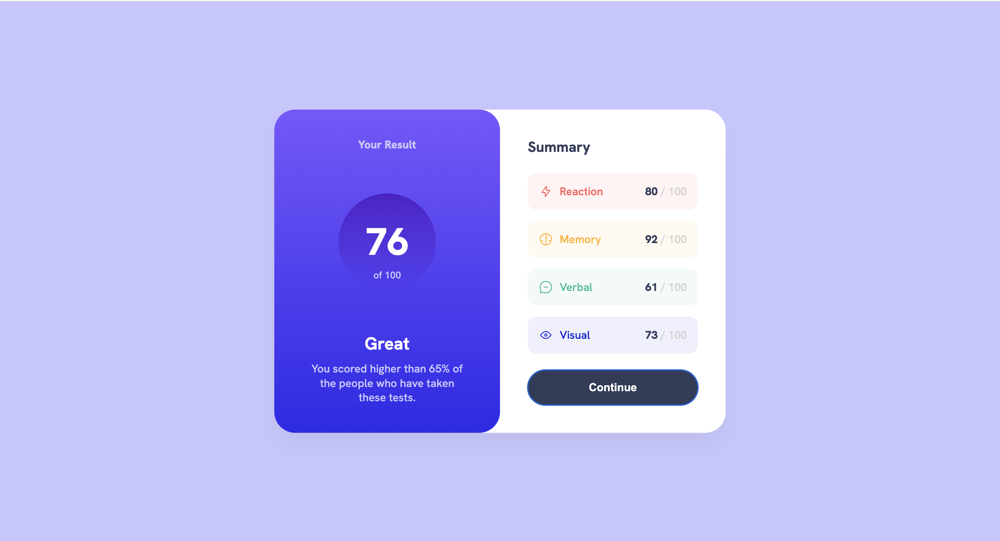

# Frontend Mentor - Results summary component solution

This is a solution to the [Results summary component challenge on Frontend Mentor](https://www.frontendmentor.io/challenges/results-summary-component-CE_K6s0maV). Frontend Mentor challenges help you improve your coding skills by building realistic projects.

## Table of contents

- [Overview](#overview)
  - [The challenge](#the-challenge)
  - [Screenshot](#screenshot)
  - [Links](#links)
- [My process](#my-process)
  - [Built with](#built-with)
  - [What I learned](#what-i-learned)
  - [Debugging & Fixes](#debugging--fixes)
  - [AI Collaboration](#ai-collaboration)

---

## Overview

### The challenge

The challenge was to build a Results Summary Component and get it looking as close to the design as possible.

Through this challenge, I needed to:

- Build a responsive layout that looks great on both mobile and desktop screens.
- Use custom colors, gradients, and transparency for different category cards.
- Implement interactive hover states for the "Continue" button.
- Ensure proper semantic markup for SEO and Accessibility.

### Screenshot

### Links

- Solution URL: https://raghad2088.github.io/Results-summary-component
- Live Site URL: https://raghad2088.github.io/Results-summary-component/

---

## My process

### Built with

- Semantic HTML5 markup
- CSS custom properties (Variables)
- Flexbox (Layout & alignment)
- CSS Modern functions (`clamp()`)

### What I learned

During this project, I focused heavily on writing clean, semantic, and highly structured HTML before jumping into CSS. Here are the key concepts I learned and mastered:

1. **Semantic HTML Structure:** I learned how to properly use structural tags like `<main>` and `<section>` to divide the card's layout into logical parts (Result and Summary) rather than relying on endless `
` tags.
2. **HTML Nesting Rules:** I learned that some tags have strict structural rules. For example, a `<ul>` or `<ol>` element must only have `<li>` tags as its direct children, and any other sub-containers (like `
` or `
`) should go inside the `<li>`.
3. **Heading Hierarchy:** I mastered the correct logical order of headings (using only one `<h1>` for the main title of the page and `<h2>` for sub-sections) to improve SEO and Accessibility.
4. **CSS Gradients & Transparency:** Instead of using the general `opacity` property which fades the whole element, I mastered using CSS variables with `hsla()` to control the background transparency of list items while keeping the text and icons perfectly readable at 100% opacity.
5. **Modern Fluid Typography & Spacing with `clamp()`:** To make the component fully responsive without writing complex media queries, I mastered the CSS `clamp()` function. By declaring `clamp(MIN, VAL, MAX)`, I created fluid paddings, card widths, and text sizes (like the large 76 score) that scale smoothly between a set minimum and maximum boundary depending on the viewport size.
6. **Clean Naming Conventions:** I improved my class naming skills (e.g., `final-score`, `continue-btn`) to make the HTML self-explanatory and much easier to style in CSS.

---

### Debugging & Fixes

Here are the critical issues I successfully identified and fixed during this challenge to achieve pixel-perfect results:

#### 1. Isolated Cards Issue (Flexbox Wrapper)

- **Problem:** The `.result` and `.summary` cards were completely detached inside the container, making it hard to control their alignment and causing gap issues.
- **Solution:** I wrapped both sections inside a `.card-wrapper` div and used `flex: 1` on the child elements to distribute the screen space evenly (50% each) on desktop.

#### 2. Overlapping Border Radius

- **Problem:** Each card had its own `border-radius`, creating weird empty spaces and gaps in the middle where they meet.
- **Solution:** I moved the major `border-radius` to the main `.card-wrapper` container and applied `overflow: hidden` to make the child elements automatically clip and adapt to the wrapper's rounded corners.

#### 3. List Item Nesting Fix

- **Problem:** Putting custom divs as direct children of a `<ul>` list, which violates standard HTML specifications.
- **Solution:** Cleaned up the list structure and ensured that the `<ul>` only contains `<li>` tags as direct children, placing any icons and numbers inside the list item itself.

---

### AI Collaboration

For this project, I collaborated with **Gemini** as an interactive coding pair-partner to refine my code and learn best practices. Here is how I utilized AI:

- **Semantic HTML Review:** Before writing any CSS, I shared my HTML structure with the AI to verify my semantic choices. The AI helped me identify a nesting error where I placed `
` tags directly under `<ul>` and guided me to wrap them correctly inside `<li>` elements.
- **Layout Debugging:** When my cards were visually separated and had issues with conflicting widths, the AI suggested creating a `.card-wrapper` container. This solved the layout issue instantly, ensuring perfect alignment, equal card heights, and a seamless `border-radius` using `overflow: hidden`.
- **CSS Best Practices:** The AI explained why using `opacity` directly on background containers was a bad practice (as it makes the child text blurry), and taught me how to use `hsla()` transparency dynamically using CSS custom properties.

**What worked well:** The collaborative workflow was incredibly effective. Instead of just getting a copy-paste solution, the AI acted as a mentor, explaining the "why" behind every fix, which significantly accelerated my learning.
